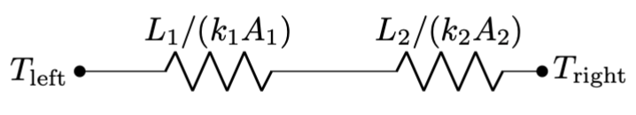
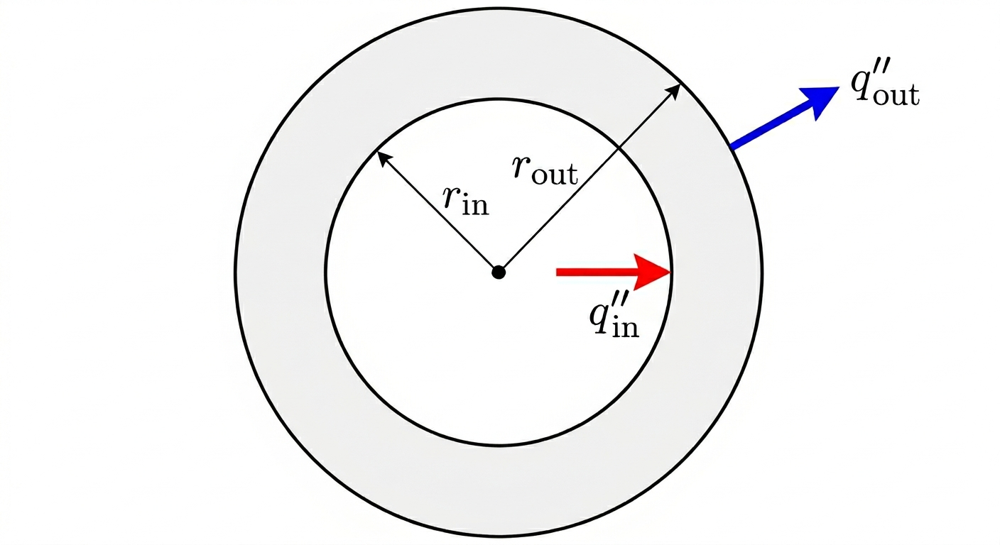

# Conduction Eqn

This week we are going to focus on conductivity, the dominant mode of heat transfer within solids. The basic picture in your head can be a rod where heat is being applied to one end and removed from the other. That is, heat is "flowing" through the solid. Conduction occurs in liquids and gases as well, but convection is more significant. And radiation occurs at the surfaces of all of them.

Starting with Fourier's Law, we will derive the conductivity equation, a PDE (partial differential equation... but don't worry). This equation will allow us to solve for temperature distributions as a function of space and time, e.g.: $T(x,y,z,t)$. We use that to derive an important approach: the "thermal resistance" model for planar, cylindrical, and spherical geometries. This is a productive way of thinking about problems and will be something that we keep coming back to.

For organization reasons, I put some introductory content in [an intro page](0intro.qmd). You should watch/read through that section, then come back here.

## Think First

Recall

1. How many boundary conditions are needed to solve a second-order differential equation?
2. What does the Second Law of Thermodynamics say about the direction of heat flow?

Look Ahead

1. How can we mathematically ingrain the truth that heat flows from hot to cold?
2. Can we consider time variation of temperature in our material? What if there is a nuclear reaction generating some heat? What if the thermal conductivity varies with temperature or position?
3. Are we going to need to solve a bunch of differential equations to get the heat transfer through a composite wall (one with multiple materials)?

## Fourier's Law

::: {.callout-tip}
## Video

Start with this video, which covers Fourier's Law and the Conduction Equation. Then read the associated sections.
:::

We have an [empirical law]{.underline} that describes heat conduction known as Fourier's Law. Stated mathematically:

::: {.column-margin}
"Empirical laws" are learned/guessed from experimental data... we can't derive them. In the case of Fourier's Law, we at least have a bit of the Second Law of Thermodynamics in there: heat flows from hot to cold. But otherwise, we guessed that the heat flux would be proportional to the temperature gradient, and invented a material property called "the thermal conductivity" that is basically the constant of proportionality.
:::

$$
\begin{align}
q''&=-k \frac{dT}{dx}\\
\mathbf{q}'' &= -k \boldsymbol{\nabla} T.
\end{align}
$$

where the first equation is when there is one dimension to the heat flow, and the second is the more general three-dimensional version.

| Symbol | Meaning | Units |
|---|---|---|
| $T$ | always temperature in this class | K or °C |
| $q''$ | heat flux | W/m² |
| $k$ | thermal conductivity, a material property | W/m·K |
| $dT/dx$ or $\boldsymbol{\nabla}$ | temperature gradient | K/m |

The general three-dimensional version of Fourier's Law involves the gradient $\boldsymbol{\nabla}$, and so it is a vector equation: the heat flux $\mathbf{q}''$ is a vector. The thermal conductivity is a material property... for foam, a really good "insulator", its value is about $k=$0.03 W/m·K. For copper, a really good "heat conductor", its value is about $k=$400 W/m·K.

::: {.callout-important}
The gradient is essentially a temperature difference as we change position, and a temperature difference of 5 K is the same as a temperature difference of 5°C. The thermal conductivity is written in as "per change in temperature", and so it does not matter if you are dealing with Kelvin or degrees Celsius: $k=$ 15 W/m·K = 15 W/m·°C. (Per-Kelvin is more standard.)
:::

### The significance of the gradient and minus sign
The "heat flux" $\mathbf{q}''$ is basically the local heat transfer rate per area $\dot{Q}/A$ (in the continuum limit). Note that it is proportional to the gradient in temperature $\boldsymbol{\nabla}T$. Recall that the gradient of a scalar field (like temperature) tells us the direction of greatest increase. The negative sign in Fourier's Law tells us that heat flows in the direction of greatest [decrease]{.underline} in temperature. That is: heat flows from hot to cold.


### The thermal conductivity

The thermal conductivity is a material property. Its value changes even with subtle changes in the material: 6061 aluminum has $k=150$ W/m·K, while 3003 aluminum has $k=180$ W/m·K. Moreover, it is a property that is highly dependent on temperature. In this class, we will usually ignore the temperature dependence and will call $k$ a constant that we evaluate at an average temperature.

There are interesting design opportunities involving materials where $k$ has high variation (e.g., a conductivity that dramatically increases with temperature), or where $k$ is direction dependent (e.g. conductivity occurs more readily in the vertical direction owing to the printing of special, orientable molecules), or where composite materials are used (such that different sections of the device have different values of $k$).


<!-- *Diagram: A slab of material with conductivity $k$, hot face $T_H$ on the left, cold face $T_C$ on the right, with $x$ increasing to the right. Heat flux arrows point right (positive $\hat{x}$).*


Seems that $\frac{dT}{dx} < 0$, but heat flux will be positive: $q'' > 0$

--- -->

## The Conduction Equation

Think back to the First Law of Thermodynamics: the Conservation of Energy. We'll apply it to a section of a solid rod (the dotted rectangle below) and assume that the energy of this section can change due to: heat conduction in, heat conduction out, and heat generation within (e.g. due to chemical or nuclear reaction).

::: {.column-margin}
We will be dealing with the Conservation of Energy, written in a few different ways, in almost every aspect of this course.
:::

```{=html}
<svg width="400" height="125" xmlns="http://www.w3.org/2000/svg">
  <title>Conduction control volume</title>
  <desc>A solid bar shown as two horizontal lines, with a dashed-border control volume in the center. An arrow labeled Q-dot-conduction(x) enters the left face and an arrow labeled Q-dot-conduction(x+Delta x) exits the right face. Q-dot-generation is labeled inside the box, and Delta x labels the width below.</desc>
  <defs>
    <marker id="cond-arrow" markerWidth="8" markerHeight="6" refX="8" refY="3" orient="auto">
      <path d="M0,0 L8,3 L0,6 z" fill="black"/>
    </marker>
  </defs>
  <line x1="0" y1="25" x2="400" y2="25" stroke="black" stroke-width="2"/>
  <line x1="0" y1="95" x2="400" y2="95" stroke="black" stroke-width="2"/>
  <rect x="175" y="28" width="50" height="64" fill="none" stroke="black" stroke-width="1.5" stroke-dasharray="4,3"/>
  <line x1="143" y1="60" x2="174" y2="60" stroke="black" stroke-width="1.5" marker-end="url(#cond-arrow)"/>
  <line x1="226" y1="60" x2="257" y2="60" stroke="black" stroke-width="1.5" marker-end="url(#cond-arrow)"/>
  <foreignObject x="0" y="47" width="140" height="26">
    <div xmlns="http://www.w3.org/1999/xhtml" style="text-align:right; font-size:14px; line-height:1">\(\dot{Q}_\text{conduction}(x)\)</div>
  </foreignObject>
  <foreignObject x="260" y="47" width="140" height="26">
    <div xmlns="http://www.w3.org/1999/xhtml" style="text-align:left; font-size:14px; line-height:1">\(\dot{Q}_\text{conduction}(x+\Delta x)\)</div>
  </foreignObject>
  <foreignObject x="155" y="47" width="90" height="26">
    <div xmlns="http://www.w3.org/1999/xhtml" style="text-align:center; font-size:14px; line-height:1">\(\dot{Q}_\text{generation}\)</div>
  </foreignObject>
  <foreignObject x="155" y="100" width="90" height="24">
    <div xmlns="http://www.w3.org/1999/xhtml" style="text-align:center; font-size:14px; line-height:1">\(\Delta x\)</div>
  </foreignObject>
</svg>
```


$$
\frac{dE}{dt} = \dot{Q}_\text{conduction,in} - \dot{Q}_\text{conduction,out} + \dot{Q}_\text{generation}.
$$

I'll include the detailed derivation in the collapsed text below. The summary is: 

- We call on Fourier's Law for the conduction terms at $x$ and $x+\Delta x$.
- We rewrite the heat generation term as a generic $\dot{Q}_\text{generated} = V \dot{q}$. That is, $\dot{q}$ is the heat generated per volume at a certain point. 
- We rewrite the energy change term via the thermodynamic model that a change in energy is proportional to the associated change in temperature via the heat capacity $mc$, where $m$ is the mass and $c$ is the specific heat (at constant volume). That is: $dE = mc dT$.

::: {.column-margin}
The quantity $mc$ is sometimes called the "thermal inertia".
:::

::: {.callout-note collapse="true"}
### Click here to see the details of the derivation.
For the conduction terms, we bring in the 1D version of Fourier's Law, making sure to include the cross-sectional area $A_\text{c}$ (remember, the heat flux $q''$ is "heat transfer per area"). For the $\dot{Q}_\text{generation}=V\dot{q}$ term, we'll also write the volume as $(\Delta x) A_c$ and the mass as $m=\rho V=\rho (\Delta x)A_c$ (where $\rho$ is the density). Then we've got
$$
\rho (\Delta x)A_c c\frac{\partial T}{\partial t} = \left(-kA_c \frac{\partial T}{\partial x}\bigg\rvert_x \right) - \left(-kA_c \frac{\partial T}{\partial x}\bigg\rvert_{(x+\Delta x)}\right)+(\Delta x)(A_c) \dot{q}(x).
$$

Almost there! Divide through by $(\Delta x)A_c$ and swap the order of the conduction terms to leave

$$
\rho (\Delta x)A_c c\frac{\partial T}{\partial t}=\frac{k\frac{\partial T}{\partial x}(x+\Delta x)-k\frac{\partial T}{\partial x}(x)}{\Delta x} + \dot{q}
$$

And then recognize that, if we take the limit as $\Delta x\rightarrow 0$, the fraction in that equation is the definition of derivative

:::

We land here, with the one-dimensional conduction equation
$$
\boxed{\rho c \frac{\partial T}{\partial t} = \frac{\partial}{\partial x}\left(k \frac{\partial T}{\partial x}\right) + \dot{q}(x,t)}
$$

and, thinking back to calculus 3, it is intuitive that the full three-dimensional conduction equation will be

$$
\boxed{\rho c \frac{\partial T}{\partial t} = \boldsymbol{\nabla} \cdot \left(k \boldsymbol{\nabla}T\right) + \dot{q}}.
$$

Note that the heat generation term can be a function of location and/or time. In general, the conduction equation is a PDE for $T(x,y,z,t)$ (if the problem is best phrased in Cartesian coordinates) or $T(r,\theta,z,t)$ (if cylindrical). Our goal is to determine the spatial and temporal distribution of temperature.

### A couple quick examples

... We'll do more in the next section

::: {#exm-conduction1}
#### Steady flow, constant conductivity, no heat generation, 1D Cartesian.

The geometry is an infinite slab where $T(x=0)=T_0$ is known and $T(x=L)=T_L$ is known. (These are the boundary conditions.) Then the Conduction Equation simplifies to

$$
\frac{d^2T}{dx^2} = 0
$$

Integrating twice will leave us with $T(x) = c_1 x + c_2$. Applying the boundary conditions:

$$
T(x) = -\left(\frac{T_0 - T_L}{L}\right)x + T_0.
$$

::: {.callout-tip}
You can work out the math in detail on your own if you want to check. You can also note that this equation is of the form $T(x) = c_1 x + c_2$ (i.e., it solves the differential equation) and it satisfies the two boundary conditions.
:::
:::


 


::: {#exm-conduction2}
#### Unsteady, with constant heat generation of $\dot{q}_0$, and we'll assume the object is small such that the spatial variation is negligible. 


We'll assume the object starts at a known temperature $T(t=0)=T_0$. Then the Conduction Equation simplifies to

$$
\rho c \frac{dT}{dt} = \dot{q}_0
$$

Integrating once will leave us with $T(t) = \frac{\dot{q}_0}{\rho c}t + d_1$, and the unknown constant $d_1$ comes from the initial condition:

$$
T(t) = \frac{\dot{q}_0}{\rho c}t + T_0
$$

::: {.callout-tip}
Check your thermodynamics intuition: if a constant heat generation is happening, will the object heat up quicker if it is a big specific heat, or a small specific heat?
:::

:::


::: {#exm-conduction3}
#### Composite planar wall

This problem will motivate the thermal resistance section. Suppose we have this situation: a "composite wall" made of materials with different thermal conductivities, $k_1$ and $k_2$. The left and right boundaries have known temperatures $T_\text{left}$ and $T_\text{right}$. It is steady, no heat generation. How should we approach?

```{=html}
<svg width="370" height="268" xmlns="http://www.w3.org/2000/svg">
  <title>Composite wall diagram</title>
  <desc>Two rectangular layers representing a two-material composite wall. The left layer has width L1 and the right layer has width L2, both the same height. T-left labels the left face temperature and T-right labels the right face temperature.</desc>
  <rect x="60" y="0" width="80" height="240" fill="#cce8f4" stroke="black" stroke-width="1.5"/>
  <rect x="140" y="0" width="160" height="240" fill="#b5791f" stroke="black" stroke-width="1.5"/>
  <foreignObject x="0" y="107" width="57" height="26">
    <div xmlns="http://www.w3.org/1999/xhtml" style="text-align:right; font-size:14px; font-family:serif"><i>T</i><sub>left</sub></div>
  </foreignObject>
  <foreignObject x="303" y="107" width="67" height="26">
    <div xmlns="http://www.w3.org/1999/xhtml" style="text-align:left; font-size:14px; font-family:serif"><i>T</i><sub>right</sub></div>
  </foreignObject>
  <foreignObject x="60" y="107" width="80" height="26">
    <div xmlns="http://www.w3.org/1999/xhtml" style="text-align:center; font-size:14px; font-family:serif">\(k_1\)</div>
  </foreignObject>
  <foreignObject x="140" y="107" width="160" height="26">
    <div xmlns="http://www.w3.org/1999/xhtml" style="text-align:center; font-size:14px; font-family:serif">\(k_2\)</div>
  </foreignObject>
  <foreignObject x="60" y="244" width="80" height="24">
    <div xmlns="http://www.w3.org/1999/xhtml" style="text-align:center; font-size:14px; font-family:serif"><i>L</i><sub>1</sub></div>
  </foreignObject>
  <foreignObject x="140" y="244" width="160" height="24">
    <div xmlns="http://www.w3.org/1999/xhtml" style="text-align:center; font-size:14px; font-family:serif"><i>L</i><sub>2</sub></div>
  </foreignObject>
</svg>
```

::: {.callout-important}
The Conduction Equation applies to a single material: there is no way to handle the abrupt change in $k$ that occurs at $x=L_1$ using a single equation.
:::

So we will need to solve the Conduction Equation twice. Actually, it is the same solution twice (see Example 1.1 above): $T_1(x) = c_1 x + d_1$ and $T_2(x) = c_2 x + d_2$. But what are the boundary conditions? It seems we need four...

$T_1(0)=T_\text{left}$ is obvious, as is $T_2(L_1+L_2)=T_\text{right}$. We need two more.

**Physical observation #1:** If the two rectangles are in perfect contact at $x=L_1$ (more on this later), they must have the same temperature. We don't know what that temperature is, but we can say $T_1(L_1)=T_2(L_1)$.

**Physical observation #2:** In order for the system to be at steady state, the amount of heat entering material 1 must be the same as the amount of heat leaving material 1 (else the rectangle 1 would be increasing in temperature). And the amount of heat entering material 2 must be the same as the amount of heat leaving material 2 (same reason). Assuming $T_\text{left}>T_\text{right}$, the heat leaving rectangle 1 must be entering rectangle 2. Framing this in terms of Fourier's Law:

$$
-k_1 \frac{dT_1}{dx}\bigg\rvert_{L_1} = -k_2 \frac{dT_2}{dx}\bigg\rvert_{L_1}.
$$

A little bit messy, but that is our fourth boundary condition!

The algebra is tedious... you can go through it if you like, but I'm going to skip it for now.


::: {.callout-tip}
## Think
We just described two linear profiles, $T_1(x)$ and $T_2(x)$. Combined, they are continuous but are not smooth at $x=L_1$. Intuitively (i.e., don't just look at the equations): if $k_1 > k_2$, is the slope of the temperature profile larger in material 1 or 2? What does that tell you about the temperature drop through insulators vs. through conductors? Does that make sense?
:::


:::

## Thermal Resistance

::: {.callout-tip}
## Video

Start with this video, which covers the thermal resistance model.
:::


### The Ohm's Law Metaphor

As engineers, we probably don't care about the temperature at every location within an object. So solving coupled differential equations to get detailed temperature distributions within composite systems, as we did in @exm-conduction3, is practically not that useful. Instead, we are going to develop a metaphor with Ohm's Law of electrical resistance, and use that to connect big design variables that engineers do care about: the total temperature difference and the total heat flow.

Recalling your electrical circuits class, Ohm's Law is

$$
(\text{voltage}) = (\text{current})(\text{resistance}) \implies V=IR.
$$

We will show in this section that we can create a mathematical metaphor with heat transfer: current is our heat transfer rate $\dot{Q}$, voltage is a temperature difference $\Delta T$, and the "thermal resistance" is a function of things like thermal conductivity $k$, cross-section area $A_\text{c}$, and material thickness $L$. That is:

$$
V=IR \implies \Delta T = \dot{Q} R_\text{thermal}
$$

or, rearranging and dropping the "thermal" subscript

$$
\dot{Q} = \frac{\Delta T}{R}.
$$

All the same Ohm's Law rules apply: resistors in series sum together: $R_\text{tot} = R_1 + R_2$. Resistors in parallel have the rule

$$
\frac{1}{R_\text{tot}}=\frac{1}{R_1}+\frac{1}{R_2}.
$$


### Assumptions

For this section we'll use:

- Steady-state: $\frac{\partial}{\partial t} = 0$
- Constant conductivity: $\nabla \cdot (k\nabla T) = k\nabla^2 T$
- One-dimensional: $\nabla^2 T = \frac{d^2T}{dx^2}$ (Cartesian) or $=\frac{1}{r}\frac{d}{dr}\left(r \frac{dT}{dr}\right)$ (Cylindrical) or $=\frac{1}{r^2}\frac{d}{dr}\left(r^2 \frac{dT}{dr}\right)$ (Spherical)
- No heat generation: $\dot{q} = 0$


### Planar Wall (Infinite)

Recall the solution from @exm-conduction1:

$$
T(x) = -\left(\frac{T_0 - T_L}{L}\right)x + T_0.
$$

Using Fourier's Law to compute the heat flux:

$$
q'' = -k\frac{dT}{dx} = k\left(\frac{T_0 - T_L}{L}\right).
$$

::: {.callout-note}
If $T_0>T_L$ we have that $q''>0$. This is meaningful: heat will flow from left to right, in the positive $x-$direction. If $T_0<T_L$, $q''<0$, which implies heat flow in the negative $x-$direction.
:::

To create the Ohm's Law metaphor, we multiply both sides by cross-section area $A_\text{c}$

$$
q''A_\text{c} = \dot{Q} = kA_\text{c}\left(\frac{T_0 - T_L}{L}\right) = \frac{\Delta T}{L/(kA_\text{c})}.
$$

That is: 

$$
\dot{Q} = \frac{\Delta T}{L/(kA_\text{c})} = \frac{\Delta T}{R_\text{planar}}
$$

and our "thermal resistance" for the planar wall geometry is 

$$
R_\text{planar} \equiv L/(kA_\text{c}).
$$

### "Composite" Wall

This is where the resistor model becomes really valuable: thinking back to @exm-conduction3, we know the total temperature drop across the system ($\Delta T = T_\text{left}-T_\text{right}$). We can write a thermal circuit with two resistors in series:



and we can compute the total heat transfer through this wall easily

$$
\dot{Q} = \frac{\Delta T}{R_\text{total}} = \frac{T_\text{left}-T_\text{right}}{L_1/(k_1 A_1)+L_2/(k_2 A_2)}.
$$


### Expanding the Metaphor

Two concepts that expand the utility of this metaphor:

**Convection:** we saw in our introduction to the three modes of heat transfer that

$$
\dot{Q}_\text{convection} = h A_\text{surface} (T-T_\infty) \implies \dot{Q}_\text{convection} = \frac{\Delta T}{1/(hA_\text{surface})}.
$$

That is,

$$
R_\text{convection} = 1/(h A_\text{surface}).
$$

**Contact Resistance**

If two rigid materials are joined together, it is unlikely that they achieve perfect contact. Rather, there may be small air gaps owing to machining imperfections, surface roughness, etc. Air is a good insulator (low $k$), and so this "contact resistance" will inhibit heat transfer. 

We can continue the Ohm's Law metaphor
$$
\dot{Q}=\frac{\Delta T}{R_\text{contact}}
$$

but the values of contact resistance are given on a "per area" basis for the material pairings:

$$
R_\text{contact}=R''_\text{contact}/A_c.
$$

(The units of $R''$ are m²⋅K/W, so we divide by the area to get the thermal resistance in K/W.) An example: for a ceramic-ceramic interface, we might have $R''_\text{contact}=0.001$ m²⋅K/W. Contact resistance also is a function of pressure -- pushing surfaces together will squish any imperfections and roughness, decreasing the amount of contact resistance. So: make sure all your bolts are tight!

Adding contact resistance to the composite wall simply involves adding a third resistor in series.

::: {.callout-note}
If we were to sketch the temperature profiles $T(x)$, the contact resistance would give a discontinuous jump in the temperature.
:::

It is sometimes worthwhile to add **thermal paste** to the contact locations. This fills the gap with a high thermal conductivity material instead of air, improving good heat transfer.


## Interactive Example

I created an interactive example for a composite wall, [find it at this link](demos/wall_demo.qmd).

## Radial Systems

Let's start with some intuition. Suppose we have the following cylindrical-shell geometry



and we will assume angular and $z-$symmetry, and steady state. If it is indeed steady state, the amount of heat entering the shell must match the amount of heat leaving the shell: $\dot{Q}_\text{in} = \dot{Q}_\text{out}$. But what can we say about the heat fluxes? Is it that $q''_\text{in} = q''_\text{out}$, or $q''_\text{in} > q''_\text{out}$, or $q''_\text{in} < q''_\text{out}$.

::: {.callout-note collapse="true"}
### Click here to see the answer

$$
\left|q''(r_\text{in}) \cdot A_\text{in}\right| = \left|q''(r_\text{out}) \cdot A_\text{out}\right|
$$

and so $q''_\text{in} > q''_\text{out}$.
:::


### Cylindrical

For both cylindrical and spherical coordinates, Fourier's Law for radial heat flow is written as 

$$
q''=-k \frac{dT}{dr}.
$$

But, unlike in the planar case, $q''$ changes as we proceed through the material. We can still use an Ohm's Law metaphor though!

We will solve the same problem as in the planar case: steady heat conduction with known temperature at the boundaries: $T(r_\text{in})=T_\text{in}$ and $T(r_\text{out})=T_\text{out}$. I'll add the derivation inside here, and it may be useful to to look through it as this is an example of solving a differential equation in cylindrical coordinates.

::: {.callout-note collapse="true"}
### Click here to see the derivation
Start from the conduction equation with $k = \text{constant}$, and we will assume steady heat transfer and no heat generation. Then we have, in cylindrical coordinates

$$
0=\nabla^2 T = \frac{1}{r}\frac{\partial}{\partial r}\left(r\frac{\partial T}{\partial r}\right) + \underbrace{\frac{1}{r^2}\frac{\partial^2 T}{\partial \theta^2}}_{\to 0, symmetry} + \underbrace{\frac{\partial^2 T}{\partial z^2}}_{\to 0, symmetry}
$$

that is

$$
0=\frac{1}{r}\frac{\partial}{\partial r}\left(r\frac{d T}{d r}\right).
$$

Solving this by integration, we find

$$
T(r)=c_1 \ln r + c_2
$$

and applying the boundary conditions:

$$
T_\text{in} = c_1 \ln r_\text{in} + c_2
$$

$$
T_\text{out} = c_1 \ln r_\text{out} + c_2.
$$

Algebra:
$$
T_\text{out} - T_\text{in} = c_1 \ln\left(\frac{r_\text{out}}{r_\text{in}}\right) \rightarrow  c_1 = \frac{T_\text{out} - T_\text{in}}{\ln(r_\text{out}/r_\text{in})}
$$

and

$$
c_2 = T_\text{in} - \frac{T_\text{out} - T_\text{in}}{\ln(r_\text{out}/r_\text{in})} \ln r_\text{in}
$$

gets us this:

$$
T(r) = T_\text{in} + \frac{T_\text{out} - T_\text{in}}{\ln(r_\text{out}/r_\text{in})} \cdot \ln\left(\frac{r}{r_\text{in}}\right).
$$

Then the heat flux is

$$
q''(r) = -k\frac{dT}{dr} = -k \frac{T_\text{out} - T_\text{in}}{\ln(r_\text{out}/r_\text{in})} \cdot \frac{1}{r}
$$

and the total heat transfer rate is

$$
|\dot{Q}| = |q''(r)| \cdot A(r) = k\frac{T_\text{out} - T_\text{in}}{\ln(r_\text{out}/r_\text{in})} \cdot \frac{1}{r} \cdot 2\pi r \cdot w
$$

where $w$ is the length in the $z-$direction. 

:::

We land here:

$$
\dot{Q} = k \frac{\Delta T}{\ln(r_\text{out}/r_\text{in})} \cdot 2\pi w
$$

and bring back the Ohm's Law metaphor:

$$
\dot{Q}= \frac{\Delta T}{R_\text{cylindrical}}
$$

and so we see

$$
R_\text{cylindrical}\equiv \frac{\ln(r_\text{out}/r_\text{in})}{2\pi k w}
$$


### Spherical Case

Same process for spherical -- steady, angular symmetry, known inner and outer temperatures. The Laplacian operator in spherical (with radial symmetry) is

$$
0 = \frac{1}{r^2}\frac{d}{dr}\left(r^2 \frac{dT}{dr}\right)
$$

Solution process is the same, Fourier's Law is $q''=-k dT/dr$, so I'll just skip to...

$$
\dot{Q} = |q''(r)| \cdot A(r) = \left(\frac{\Delta T}{\frac{1}{r_\text{in}} - \frac{1}{r_\text{out}}}\right) \cdot \frac{k}{r^2} \cdot 4\pi r^2 = \left(\frac{\Delta T}{\frac{1}{r_\text{in}} - \frac{1}{r_\text{out}}}\right) 4\pi k
$$

From which we see 

$$
R_\text{sphere} = \frac{\frac{1}{r_\text{in}} - \frac{1}{r_\text{out}}}{4\pi k}.
$$


### Applying these equations

We can have composite cylinders/spheres: concentric rings of different materials and different thicknesses. We can add convection on the interior and exterior (remembering that the surface area of a cylinder is $A_\text{surf}=2\pi R L$ and of a sphere is $A_\text{surf}=4\pi R^2$). We can write resistors in series, and if we know the interior and exterior temperatures, we can determine the total amount of heat transfer out of these configurations. Nice.